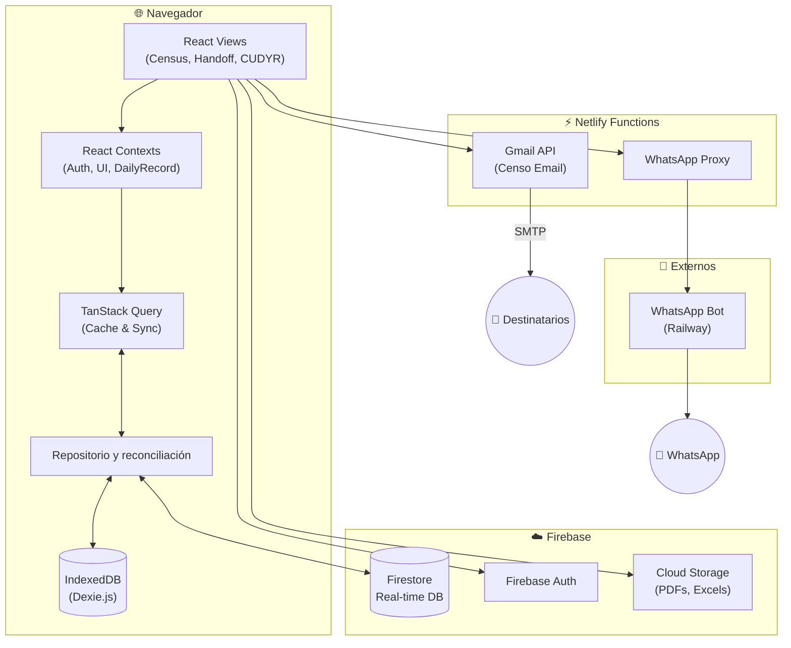
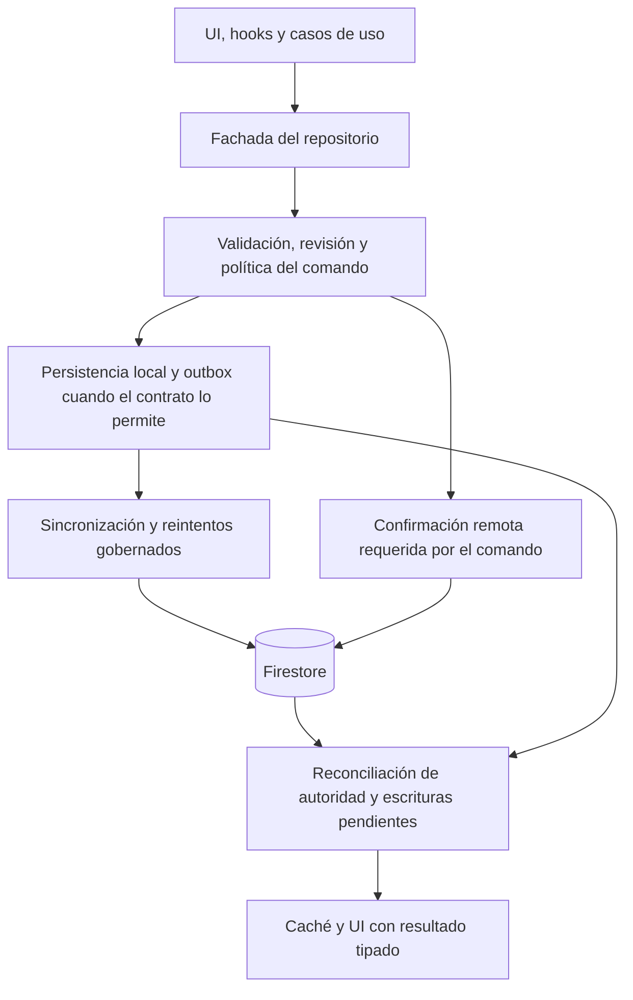

# Arquitectura del Sistema HHR

Sistema de gestión de censo diario de pacientes hospitalizados para el Hospital Hanga Roa.

---

## 🏗️ Diagrama de Alto Nivel



---

## ✅ Enfoque de Estabilidad

- **Continuidad local:** IndexedDB conserva caché y operaciones pendientes; la precedencia local/remota se resuelve en el repositorio, según el contrato del censo.
- **Integridad clínica:** validación estricta con Zod + guardas de regresión.
- **Concurrencia segura:** las escrituras clínicas respetan la revisión y autoridad del censo; una proyección optimista no equivale a una confirmación remota.
- **Recuperación:** auto-repair de IndexedDB y fallback controlado.
- **Auth por entorno:** popup como flujo principal, acceso directo solo cuando la configuración Firebase lo soporta y advertencias de arranque cuando faltan variables críticas.
- **Observabilidad local:** métricas y logs guardados localmente para diagnóstico offline.
- **Cola de sync:** cambios encolados con deduplicación y backoff.

El contrato vigente de lectura, escritura y reconciliación del censo está en
[ADR Daily Record Runtime Path](docs/ADR_DAILY_RECORD_RUNTIME_PATH.md).
Para más detalle de flujos y decisiones, ver [docs/architecture.md](docs/architecture.md).
Para resumen ejecutivo y stack, ver este documento.
La taxonomía canónica del repo vive en `docs/CODEBASE_CANON.md`.

## Guardrails de calidad

- La guía transversal de calidad está en `docs/QUALITY_GUARDRAILS.md`.
- El checklist mínimo de cambios seguros está en `docs/SAFE_CHANGE_CHECKLIST.md`.
- Los entrypoints operativos de CI/reporting de Fase 4 son:
  - `npm run ci:quality-core`
  - `npm run check:quality`
  - `npm run report:quality-metrics`
  - `npm run report:operational-health`
  - `npm run report:runtime-contracts`

---

## 📦 Stack Tecnológico

| Capa                          | Tecnología                |
| ----------------------------- | ------------------------- |
| UI                            | React                     |
| Lenguaje                      | TypeScript                |
| Build                         | Vite                      |
| Caché y estado remoto         | TanStack Query            |
| Estilos                       | CSS y utilidades Tailwind |
| Base de datos y autenticación | Firestore y Firebase Auth |
| Almacenamiento local          | IndexedDB (Dexie.js)      |
| Validación                    | Zod                       |
| Pruebas                       | Vitest y Playwright       |
| Hosting                       | Netlify                   |

Las versiones declaradas se mantienen en [package.json](package.json) y las resoluciones
exactas en [package-lock.json](package-lock.json). Este resumen no duplica números de
versión: una actualización de dependencias debe cambiar esas fuentes, sin exigir una
segunda actualización manual de esta tabla. Las dependencias de Firebase Functions
se resuelven por separado en [functions/package-lock.json](functions/package-lock.json).

---

## 🗂️ Estructura de Directorios (src/)

```
src/
├── components/                 # Componentes UI (Layout, Census, Shared)
├── features/                   # Módulos por funcionalidad
│   ├── admin/                  # Auditoría, Configuración, Salud del Sistema
│   ├── analytics/              # Estadísticas MINSAL, gráficos
│   ├── census/                 # Gestión de camas y pacientes
│   ├── cudyr/                  # Scoring de dependencia y categorización
│   ├── handoff/                # Entrega de Turno (Enfermería/Médica)
│   ├── whatsapp/               # Integración con bot de notificaciones
│   └── errors/                 # Monitoreo de errores en runtime
│
├── core/                       # Núcleo técnico
│   ├── ui/                     # Sistema de Diseño (@core/ui) - Botones, Modales, Inputs
│   └── auth/                   # Lógica de Autenticación
│
├── domain/                     # Lógica de Negocio Pura (Agnóstica de Framework)
│   └── CensusManager.ts        # Reglas de movimiento, alta y egreso
│
├── services/                   # Infraestructura y Persistencia
│   ├── repositories/           # Patrón Repository para Firestore/IDB
│   ├── storage/                # Implementación de persistencia física
│   ├── backup/                 # Gestión de respaldos en la nube
│   └── pdf/                    # Generación dinámica de documentos
│
├── context/                    # Estado Global (Shared Contexts)
├── hooks/                      # Hooks transversales y composición React
├── application/                # Casos de uso, outcomes homogéneos y puertos
├── infrastructure/             # Placeholder retirado (no agregar código nuevo)
├── schemas/                    # Validación Zod (Seguridad en runtime)
├── types/                      # Definiciones de tipos del dominio
├── utils/                      # Helpers y utilidades técnicas
└── tests/                      # Pruebas unitarias y de integración
```

---

## 🔄 Flujo del censo



El orden depende de la operación. El diagrama muestra responsabilidades, no una
transacción universal: un guardado local pendiente y una escritura clínica
confirmada remotamente son resultados distintos.

| Operación                          | Regla relevante                                                                                                      | Fuente canónica                                                                            |
| ---------------------------------- | -------------------------------------------------------------------------------------------------------------------- | ------------------------------------------------------------------------------------------ |
| Lectura y suscripción              | Reconciliar local/remoto y distinguir ausencia confirmada de indisponibilidad transitoria.                           | [ADR del censo](docs/ADR_DAILY_RECORD_RUNTIME_PATH.md)                                     |
| Guardado o patch                   | Preparar y validar el cambio; respetar la revisión esperada y las guardas del comando.                               | [Servicio de escritura](src/services/repositories/dailyRecordRepositoryWriteService.ts)    |
| Cambio que exige autoridad clínica | Confirmar remotamente antes de tratar la operación como finalizada; un rechazo no se transforma en éxito local.      | [Persistencia remota](src/services/repositories/dailyRecordRemotePersistenceController.ts) |
| Cambio local pendiente             | Mantener registro y outbox coherentes; reconciliar el acuse de confirmación antes de reemplazar la proyección local. | [ADR del censo](docs/ADR_DAILY_RECORD_RUNTIME_PATH.md)                                     |

Un error no implica siempre el mismo rollback: el resultado tipado declara si la
operación quedó pendiente, bloqueada o confirmada y orienta la recuperación.

---

## 🧩 Contratos de Datos (Resumen)

- **DailyRecord:** `date` ISO, pacientes por cama en `beds`, `activeExtraBeds` e identidad de episodio validados antes de persistir.
- **Patch parcial:** rutas y valores serializables; revisión esperada y política del comando para resolver concurrencia.
- **SyncTask:** `type`, `key`, `status`, `attempts`, `nextAttemptAt`.

---

## 🧭 Cómo leer esta arquitectura (para novatos)

1. **Empieza por el flujo de datos**: mira “Flujo del censo” para entender qué pasa cuando el usuario guarda o edita.
2. **Ubica la capa donde ocurre cada cosa**: UI/Views dispara acciones, Hooks coordinan, Repositories persisten, Storage escribe/lee.
3. **Aprende los contratos de datos**: estos “acuerdos” evitan errores al mover datos entre capas.
4. **Revisa estabilidad y seguridad**: mira “Enfoque de Estabilidad” y “Seguridad” para entender por qué el sistema no se cae y protege datos.
5. **Si algo falla**: consulta el ADR del censo y los runbooks para ubicar el punto de diagnóstico.

---

## 🔌 Boundary Actual (Use Cases + Ports)

- `src/application/*` coordina side-effects críticos y devuelve `ApplicationOutcome`.
- `src/application/ports/*` es el único lugar donde los use-cases pueden atarse por defecto a servicios concretos.
- `RepositoryProvider` es obligatorio; los consumers no deben depender de fallbacks implícitos.
- `services/infrastructure/*` recibe dependencias por factory/constructor cuando actúa como provider reutilizable.
- `src/hooks/*`, `src/components/*` y `src/features/*` no deben importar directo:
  - `auditService`
  - `DailyRecordRepository`
  - `ClinicalDocumentRepository`
  - `censusEmailService`
- Si una operación ya existe en `application/`, la UI debe consumir el use-case o un hook fachada, no el servicio remoto.
- Este boundary se verifica automáticamente con `npm run check:application-port-boundary`.

### Foundation boundaries por dominio (2026-04-20)

- Referencia canónica: `docs/superpowers/specs/2026-04-20-domain-boundaries-foundation.md`.
- Dominios incluidos en la primera ola de enforcement incremental:
  - `src/features/cudyr/**/*`
  - `src/features/handoff/**/*`
  - `src/components/layout/**/*`

---

## ✅ Checklist de Consistencia (ARCHITECTURE vs docs/architecture)

## Evidencia de calidad

Los conteos de archivos, cobertura y deuda son datos generados, no una propiedad
estable de la arquitectura. Consultar la ejecución de CI del SHA evaluado y sus
artefactos según el [runbook de evidencia](docs/RUNBOOK_RELEASE_EVIDENCE_CONTRACT.md).
Un snapshot histórico en `reports/` no demuestra el estado del checkout actual.

## Notas de Operación

- El acceso alternativo de Google no se ofrece automáticamente en `localhost` salvo habilitación explícita.
- Cuando IndexedDB falla por bloqueo o backing store, la app intenta una auto-recuperación inicial y solo luego expone UI de aviso.
- **Capas**: UI y casos de uso → repositorios → almacenamiento, según los boundaries vigentes.
- **Contratos**: lectura, escritura y reconciliación del censo definidos en su ADR.
- **Stack**: versiones declaradas en `package.json` y resueltas en los lockfiles.

---

## 🧱 Patrones de Diseño

### 1. Repository Pattern

Abstrae la complejidad de elegir entre almacenamiento local (IDB) o remoto (Firestore).

```typescript
import { DailyRecordRepository } from '@/services/repositories/DailyRecordRepository';
const record = await DailyRecordRepository.getForDate('2026-01-08');
```

### 2. Export & Backup Manager

Manejador centralizado para la generación de documentos y su respaldo automático en la nube.

```typescript
const { handleBackupHandoff } = useExportManager();
// Gatilla PDF local + Backup Cloud automáticamente
```

### 3. TanStack Query Hooks

Gestiona el ciclo de vida de los datos, revalidación y estados de carga.

```typescript
const { data } = useDailyRecordQuery(dateString);
const mutation = useSaveDailyRecordMutation();
```

### 4. Interoperabilidad (HL7 FHIR)

Utiliza transformadores para convertir datos del dominio HHR a recursos estándar FHIR R4 (Core-CL).

```typescript
import { mapPatientToFhir } from '@/services/utils/fhirMappers';
const fhirPatient = mapPatientToFhir(localPatient);
```

---

## 🔐 Seguridad

- **RBAC:** Control de acceso en `utils/permissions.ts`.
- **Validation:** Validación estricta con Zod antes de persistir cualquier dato.
- **Auditoría:** Registro inmutable de cada cambio crítico en el sistema.

---

_Revisión del stack, flujo del censo y evidencia: 28 de septiembre de 2026._
