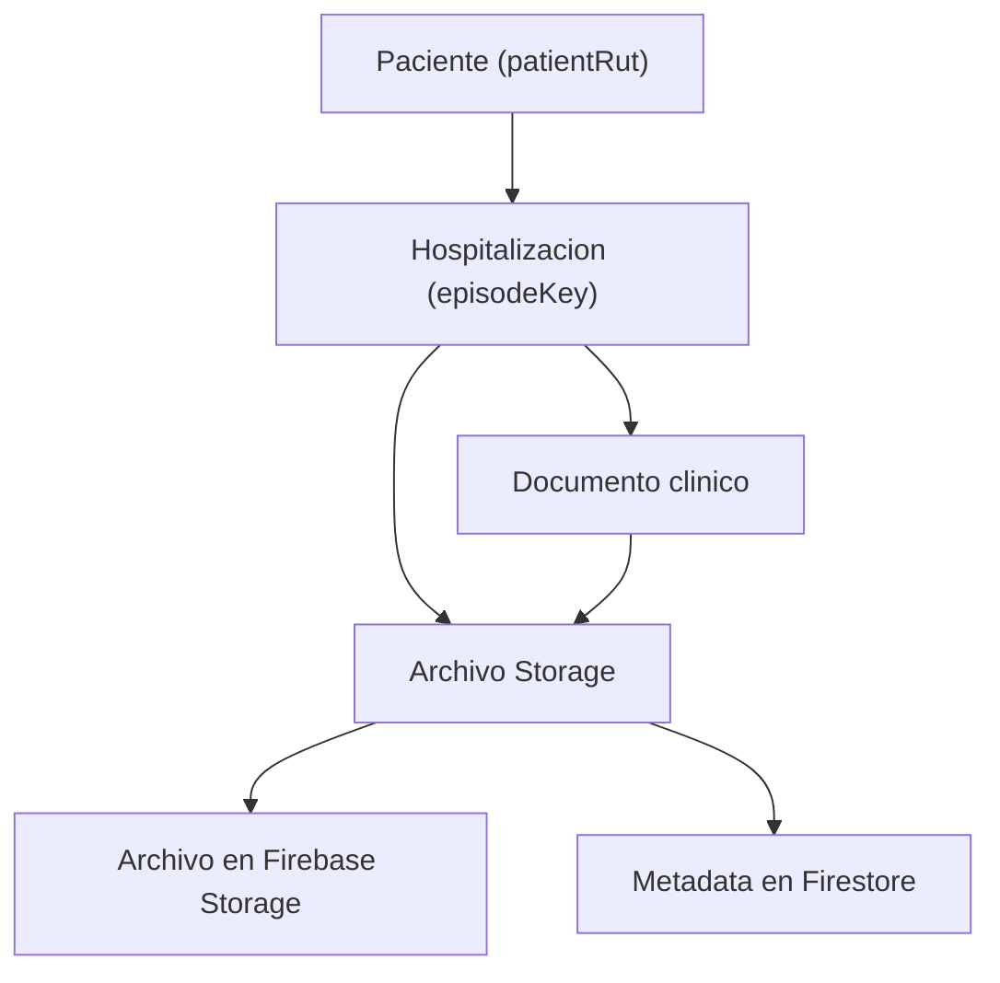

# Diseno: Archivos del episodio en Firebase Storage por paciente y hospitalizacion

## Estado

Propuesto para implementacion por fases. Este documento define la arquitectura objetivo antes de tocar codigo de produccion.

## Objetivo

Crear un sistema ordenado de archivos del episodio asociado a un paciente identificado por RUT y a sus hospitalizaciones, usando Firebase Storage para archivos y Firestore para metadata indexable.

El objetivo no es solo permitir imagenes mas grandes. La meta clinica es que documentos clinicos y archivos anexos puedan revisarse juntos, por paciente y por episodio de hospitalizacion, sin inflar el JSON del documento clinico ni arriesgar fallas silenciosas por limites de Firestore.

## Problema actual

El editor de documentos clinicos permite pegar imagenes inline. Esas imagenes quedan embebidas como `data:image/...;base64` dentro del HTML de una seccion o de `annexContent`. Ese HTML forma parte del `ClinicalDocumentRecord`, por lo que termina dentro del JSON exportado y del documento Firestore.

Esto tiene cuatro problemas:

1. El base64 aumenta el tamano del archivo respecto del binario original.
2. Firestore tiene un limite practico estricto por documento, por lo que un documento con imagenes puede fallar al guardar.
3. El historial de versiones puede duplicar contenido de secciones, amplificando el tamano final.
4. Los anexos quedan mezclados con el cuerpo textual, sin una vista documental ordenada por paciente/hospitalizacion.

El fusible actual bloquea imagenes sobre `300 KB`. Ese limite fue intencionalmente conservador para evitar documentos Firestore cercanos al limite. Para la experiencia clinica diaria, conviene subir un poco el limite inline, pero la solucion duradera es sacar archivos grandes del JSON.

## Decision principal

Implementar un modulo de `Archivos del episodio` dentro del flujo existente de documentos clinicos:

- Archivos binarios van a Firebase Storage.
- Metadata y relaciones van a Firestore.
- El documento clinico conserva HTML liviano.
- Si se inserta una imagen en el texto, el HTML guarda una URL/referencia a Storage, no base64 pesado.
- PDF, DOCX y otros archivos se manejan como archivos listables, no como contenido inline.
- La vista principal se organiza por RUT, con agrupacion secundaria por hospitalizacion.

## Alcance funcional

### Incluido

- Subir imagenes, PDF y DOCX como archivos del episodio.
- Asociar cada archivo a:
  - `hospitalId`
  - `patientRut`
  - `episodeKey`
  - `documentId` opcional
  - `sectionId` opcional
  - `source` del archivo
- Listar archivos por RUT y por episodio.
- Mostrar, en un mismo visor, documentos clinicos y archivos Storage agrupados por hospitalizacion.
- Insertar imagenes subidas a Storage dentro del editor como ``.
- Mantener PDF/DOCX como archivos archivos descargables/visualizables, no inline.
- Comprimir imagenes grandes en cliente antes de subirlas.
- Informar al usuario cuando una imagen fue comprimida, rechazada o subida como archivo del episodio.
- Subir el limite inline actual desde `300 KB` a `500 KB`.

### Excluido de la primera implementacion

- OCR de PDF o imagenes.
- Versionado binario completo del archivo.
- Edicion avanzada de PDF/DOCX en navegador.
- Migracion automatica masiva de imagenes base64 ya guardadas en documentos antiguos.
- Firma digital o auditoria legal ampliada sobre cada archivo.

Estas exclusiones son deliberadas para evitar una reescritura del modulo. El sistema debe partir como archivos del episodio confiables y navegables.

## Modelo conceptual

Hay tres entidades relacionadas:

1. Paciente por RUT.
2. Hospitalizacion por `episodeKey`.
3. Archivos del episodio vinculados a una hospitalizacion y, opcionalmente, a un documento clinico.

Un paciente puede tener muchas hospitalizaciones. Cada hospitalizacion puede tener documentos clinicos y archivos. Un archivo puede pertenecer al episodio completo o estar asociado a un documento/seccion concreta.



## Rutas de Firebase Storage

Ruta propuesta:

```text
clinical-attachments/{hospitalId}/{patientRutKey}/{episodeKey}/{attachmentId}/{safeFileName}
```

Donde:

- `hospitalId`: hospital activo, por ejemplo `hhr`.
- `patientRutKey`: RUT normalizado para path, sin puntos, guion seguro, por ejemplo `13545665-9`.
- `episodeKey`: el mismo identificador usado por documentos clinicos.
- `attachmentId`: UUID o id generado por el cliente.
- `safeFileName`: nombre sanitizado, conservando extension.

Ejemplo:

```text
clinical-attachments/hhr/13545665-9/13545665-9__2026-04-15/att_01hv.../ecografia-abdominal.pdf
```

Esta ruta permite:

- borrar un archivo sin adivinar nombres;
- auditar por paciente y episodio;
- evitar carpetas planas incontrolables;
- limitar reglas de Storage al prefijo clinico correcto;
- mantener el archivo real separado de la metadata indexable.

## Metadata en Firestore

Coleccion propuesta:

```text
hospitals/{hospitalId}/clinicalAttachments/{attachmentId}
```

Documento `ClinicalAttachmentRecord`:

```ts
interface ClinicalAttachmentRecord {
  id: string;
  hospitalId: string;
  patientRut: string;
  patientRutKey: string;
  patientName?: string;
  episodeKey: string;
  admissionDate?: string;
  sourceDailyRecordDate?: string;
  bedId?: string;

  documentId?: string;
  documentType?: ClinicalDocumentType;
  sectionId?: string;

  storagePath: string;
  downloadUrl?: string;
  originalFileName: string;
  displayName: string;
  contentType: string;
  fileKind: 'image' | 'pdf' | 'docx' | 'other';
  sizeBytes: number;

  image?: {
    width?: number;
    height?: number;
    compressed: boolean;
    originalSizeBytes?: number;
    compressionQuality?: number;
  };

  status: 'active' | 'deleted' | 'upload_failed';
  createdAt: string;
  createdBy: ClinicalDocumentAuditActor;
  updatedAt: string;
  updatedBy: ClinicalDocumentAuditActor;
  deletedAt?: string;
  deletedBy?: ClinicalDocumentAuditActor;
}
```

### Por que metadata en Firestore

No conviene listar Storage para construir la UI. Storage no es una base documental, es un repositorio de blobs. Firestore debe ser la fuente indexable para:

- buscar por RUT;
- agrupar por episodio;
- filtrar por tipo;
- mostrar fecha, usuario, nombre clinico y peso;
- ocultar archivos borrados;
- relacionar archivos con documentos clinicos.

## Relaciones con documentos clinicos

El `ClinicalDocumentRecord` no debe guardar el archivo ni metadata pesada. Como maximo puede guardar referencias ligeras cuando una imagen se inserta dentro del cuerpo:

```html

```

El ID y el path permiten:

- reconocer que la imagen viene de Storage;
- mantener compatibilidad con impresion/PDF;
- no romper el editor;
- no duplicar binarios en JSON.

El sanitizador HTML debe permitir solo estos atributos controlados en `IMG`:

- `src`
- `alt`
- `data-clinical-attachment-id`
- `data-clinical-document-storage-path`

No se deben permitir atributos libres ni eventos.

## Limites propuestos

### Inline en JSON/HTML

- Nuevo limite: `500 KB`.
- Solo imagenes.
- Solo cuando el usuario pega directamente una imagen pequena.
- Se mantiene como conveniencia rapida.

Justificacion: es un poco mas flexible que `300 KB`, pero sigue dejando margen para texto, metadata e historial. Subirlo a cerca de `1 MB` no es recomendable porque base64, sanitizacion, version history y campos adicionales pueden empujar el documento al limite real de Firestore.

### Storage sin compresion

- Imagenes hasta `2 MB`: subir directo a Storage.
- PDF hasta `15 MB`.
- DOCX hasta `15 MB`.
- Otros archivos permitidos solo si estan en lista blanca.

### Imagenes con compresion

- Imagenes entre `2 MB` y `10 MB`: intentar compresion client-side antes de subir.
- Objetivo inicial de compresion: menor a `2 MB`, manteniendo legibilidad clinica.
- Ancho maximo sugerido: `1800 px`.
- Formato de salida: JPEG para fotos, PNG/WEBP solo si el tipo original lo justifica y el navegador lo soporta.
- Calidad inicial: `0.82`, con degradacion progresiva hasta `0.70` si sigue sobre el objetivo.

### Rechazo

- Imagenes que no logren bajar de `2 MB` tras compresion: mostrar error claro.
- Imagenes originales sobre `10 MB`: pedir compresion externa o rechazar antes de procesar para no congelar el navegador.
- PDF/DOCX sobre `15 MB`: rechazar con mensaje claro.

Los limites deben vivir en un contrato central, por ejemplo `clinicalAttachmentLimits.ts`, no repartidos en componentes.

## Flujo de usuario

### Pegado de imagen pequena

1. Usuario pega imagen en editor.
2. Si pesa `<= 500 KB`, se permite inline como hoy.
3. El status bar/autosave se comporta igual.

### Pegado de imagen mediana

1. Usuario pega imagen `> 500 KB` y `<= 2 MB`.
2. El sistema la sube a Storage.
3. Crea `ClinicalAttachmentRecord`.
4. Inserta `` en el editor.
5. Muestra aviso: "Imagen guardada como archivo del episodio".

### Pegado de imagen grande

1. Usuario pega imagen `> 2 MB` y `<= 10 MB`.
2. El sistema abre un mini flujo de compresion.
3. Muestra peso original y peso estimado final.
4. Si comprime bien, sube a Storage.
5. Crea metadata.
6. Inserta imagen referenciada o la deja como archivo del episodio, segun accion del usuario.

### Subir archivo al episodio

1. Usuario pulsa `Adjuntar`.
2. Selecciona PDF, imagen o DOCX.
3. El sistema valida tipo y tamano.
4. Si imagen grande, ofrece compresion.
5. Sube a Storage.
6. Crea metadata.
7. El archivo aparece en el visor del episodio y en la vista global por paciente.

## Visores

### Visor por hospitalizacion

Dentro del contexto actual de censo/documentos clinicos:

- Seccion "Documentos clinicos":
  - Epicrisis
  - Informes
  - Evoluciones
- Seccion "Archivos del episodio":
  - Imagenes
  - PDF
  - DOCX
  - Otros permitidos

Cada item debe mostrar:

- icono por tipo;
- nombre;
- fecha de subida;
- usuario;
- peso;
- origen: episodio completo, documento clinico o seccion.

### Visor global por paciente

Desde busqueda global o ficha del paciente:

- Header con paciente/RUT.
- Timeline o lista por hospitalizacion.
- Cada episodio muestra:
  - rango de fechas;
  - cama/servicio si existe;
  - documentos clinicos;
  - archivos Storage;
  - acciones de abrir/descargar.

Este visor responde a la necesidad principal: al revisar un RUT, no mirar solo el episodio actual ni solo documentos clinicos. Debe existir una vision global del material clinico asociado al paciente, subordinada luego por hospitalizacion.

## UI propuesta

### En documentos clinicos

Agregar una pestana o bloque compacto:

```text
Archivos del episodio
  [Adjuntar] [Pegar imagen] [Comprimir imagen]

  Hospitalizacion actual
  - PDF informe externo.pdf
  - Imagen herida.jpg
  - DOCX epicrisis externa.docx
```

En el editor:

- Pegar imagen pequena: inline.
- Pegar imagen mediana/grande: Storage + referencia.
- Adjuntar PDF/DOCX: queda en panel de archivos del episodio, no se inserta en texto salvo enlace opcional.

### En busqueda global/censo diario

El boton "Documentos clinicos" debe evolucionar a algo parecido a:

```text
Documentos clínicos y archivos
  Documentos clinicos (3)
  Archivos del episodio (5)
```

Al abrir:

- primero episodios del paciente;
- luego contenido por episodio;
- click en documento abre visor de documentos clinicos;
- click en archivo abre preview/descarga segun tipo.

## Seguridad

### Storage rules

Agregar prefijo:

```text
match /clinical-attachments/{hospitalId}/{patientRutKey}/{episodeKey}/{attachmentId}/{fileName} {
  allow read: if canReadClinicalStorage();
  allow write: if hasClinicalWriteRole()
               && request.resource.size < 15 * 1024 * 1024
               && request.resource.contentType.matches('image/.*|application/pdf|application/vnd.openxmlformats-officedocument.wordprocessingml.document');
}
```

Regla importante: la seguridad final no debe depender solo del path. Firestore metadata tambien debe validar roles y hospital activo. Si se requiere mayor control por hospital, esa validacion debe alinearse con las reglas actuales del resto del sistema.

### Firestore rules

La metadata `clinicalAttachments` debe:

- permitir lectura a roles clinicos con acceso de lectura;
- permitir create/update/delete logico a roles con escritura clinica;
- impedir escritura publica;
- validar campos minimos si las reglas actuales lo permiten sin volverlas inmanejables.

### Borrado

Primer MVP:

- Borrado logico en Firestore: `status: 'deleted'`.
- Intento de borrado fisico en Storage.
- Si falla el borrado fisico, se mantiene metadata borrada y se registra telemetria.

Esto evita que un fallo de Storage bloquee la UI y deja espacio para limpieza posterior.

## Compresion de imagenes

Implementar un servicio puro/injectable:

```ts
compressClinicalAttachmentImage(file, options): Promise<CompressionResult>
```

Resultado:

```ts
type CompressionResult =
  | { status: 'not_needed'; file: File }
  | {
      status: 'compressed';
      file: File;
      originalSizeBytes: number;
      compressedSizeBytes: number;
      quality: number;
    }
  | { status: 'failed'; reason: string };
```

Tecnica:

- `createImageBitmap` si esta disponible.
- fallback con `HTMLImageElement`.
- render a `canvas`.
- `canvas.toBlob`.
- mantener orientacion lo mejor posible segun soporte navegador; si no hay EXIF handling, documentarlo como limite inicial.

El UI debe decir:

- "Imagen comprimida de 4.8 MB a 1.6 MB".
- "No se pudo comprimir manteniendo un tamano seguro".
- "Archivo demasiado grande para procesar en este navegador".

## Arquitectura propuesta

Nuevas piezas dentro de `src/features/clinical-documents`:

```text
domain/clinicalAttachmentTypes.ts
contracts/clinicalAttachmentRuntimeContracts.ts
controllers/clinicalAttachmentFilePolicy.ts
controllers/clinicalAttachmentPathController.ts
controllers/clinicalAttachmentImageCompressionController.ts
services/clinicalAttachmentStorageService.ts
hooks/useClinicalAttachments.ts
components/ClinicalAttachmentsPanel.tsx
components/ClinicalAttachmentsViewer.tsx
```

Repositorio compartido o servicio:

```text
src/services/repositories/ClinicalAttachmentRepository.ts
```

Runtime Storage:

```text
src/services/firebase-runtime/clinicalAttachmentRuntime.ts
```

La UI no debe importar Firebase directo. Debe consumir hooks/use-cases con outcomes tipados.

## Use cases

```ts
executeUploadClinicalAttachment(input): Promise<ApplicationOutcome<ClinicalAttachmentRecord>>
executeListClinicalAttachmentsByEpisode(input): Promise<ApplicationOutcome<ClinicalAttachmentRecord[]>>
executeListClinicalAttachmentsByPatient(input): Promise<ApplicationOutcome<ClinicalAttachmentRecord[]>>
executeDeleteClinicalAttachment(input): Promise<ApplicationOutcome<void>>
```

Los use cases deben:

- validar tipo/tamano;
- comprimir imagen si corresponde;
- subir a Storage;
- crear metadata Firestore;
- registrar telemetria en fallos;
- devolver mensajes seguros para usuario.

## Integracion con el editor

El hook actual de pegado debe cambiar a una politica de tres carriles:

1. `inline-image`: `<= 500 KB`.
2. `storage-image`: `> 500 KB` y permitido por Storage/compresion.
3. `rejected-image`: excede limites o falla compresion.

El editor no debe saber como subir a Firebase. Debe recibir callbacks:

```ts
onUploadPastedImage?: (file: File, context: AttachmentContext) => Promise<UploadedAttachmentImage>
onImagePasteRejected?: (message: string) => void
```

Cuando `onUploadPastedImage` no exista, el sistema puede rechazar imagenes sobre el limite inline con mensaje claro. Eso permite que tests y usos aislados del editor sigan funcionando.

## Export JSON

El JSON de documentos clinicos debe seguir incluyendo el HTML textual y referencias livianas, pero no binarios grandes.

Se agregan dos opciones:

1. Exportar solo documento clinico:
   - contiene `ClinicalDocumentRecord`;
   - imagenes Storage quedan como URL/referencia;
   - no incluye archivos binarios.

2. Exportar paquete clinico futuro:
   - documento clinico;
   - metadata de archivos;
   - manifiesto de archivos;
   - eventualmente descarga ZIP.

La primera implementacion no debe prometer ZIP si no se construye aun.

## Compatibilidad con documentos antiguos

Documentos con imagenes base64 antiguas deben seguir abriendo. No se debe romper la lectura.

No hacer migracion masiva automatica en la primera fase. Como mejora posterior:

- detectar documentos con base64 grandes;
- ofrecer "migrar imagenes a archivos del episodio";
- subir cada imagen a Storage;
- reemplazar `src=data:image...` por `src=downloadUrl`;
- registrar version.

Esto debe ser opt-in o admin-tool, no silencioso.

## Observabilidad y errores

Eventos sugeridos:

- `clinical_attachment_upload_started`
- `clinical_attachment_upload_succeeded`
- `clinical_attachment_upload_failed`
- `clinical_attachment_image_compressed`
- `clinical_attachment_image_compression_failed`
- `clinical_attachment_delete_failed`

Mensajes al usuario deben ser clinicamente claros:

- "No se pudo subir el archivo. El documento no fue modificado."
- "La imagen fue comprimida antes de guardarse."
- "El archivo supera el limite permitido para archivos del episodio."

Nunca debe quedar una imagen insertada en el editor si el upload/metadata fallo antes.

## Riesgos y mitigaciones

### Riesgo: archivo subido pero metadata falla

Mitigacion:

- si metadata falla despues del upload, intentar borrar Storage;
- registrar telemetria si el borrado compensatorio falla;
- mostrar error y no insertar referencia.

### Riesgo: metadata creada pero upload falla

Mitigacion:

- crear metadata solo despues de upload exitoso;
- no usar metadata "pending" en primera fase salvo que exista UI clara de recuperacion.

### Riesgo: download URL expira o cambia

Mitigacion:

- guardar `storagePath` como verdad durable;
- `downloadUrl` puede cachearse pero debe poder regenerarse;
- para render de editor, usar URL actual al momento de insertar; para visores, resolver desde `storagePath` si hace falta.

### Riesgo: reglas demasiado permisivas

Mitigacion:

- whitelist estricta de content types;
- limite por tamano en Storage rules;
- tests estaticos sobre `storage.rules`;
- roles iguales a almacenamiento clinico existente.

### Riesgo: interfaz confusa

Mitigacion:

- separar "documentos clinicos" de "archivos del episodio";
- mostrar ambos bajo "Documentos clínicos y archivos";
- agrupar por hospitalizacion;
- estado visible para upload/compresion.

## Fases de implementacion recomendadas

### Fase 1: Contrato y Storage basico

- Subir limite inline a `500 KB`.
- Crear tipos, runtime contracts y file policy.
- Crear path controller para Storage.
- Crear `ClinicalAttachmentRepository`.
- Agregar reglas Storage para `clinical-attachments`.
- Tests de path, policy, contracts y rules.

Salida: se pueden subir/listar archivos del episodio desde use cases, aunque aun no exista UI completa.

### Fase 2: Panel de archivos del episodio

- Agregar `ClinicalAttachmentsPanel` al workspace de documentos clinicos.
- Permitir adjuntar imagen/PDF/DOCX.
- Mostrar lista por episodio actual.
- Abrir/descargar archivos.
- Borrado logico.

Salida: usuarios pueden manejar archivos anexos sin inflar documentos clinicos.

### Fase 3: Integracion con pegado de imagenes y compresion

- Cambiar paste controller a carriles inline/storage/rejected.
- Agregar compresion de imagenes.
- Insertar imagen Storage en editor cuando corresponda.
- Avisos visibles de compresion/subida.

Salida: pegar imagen grande deja de ser peligroso; Storage se usa automaticamente.

### Fase 4: Visor global por paciente

- Crear query por RUT.
- Agrupar por hospitalizacion.
- Unificar documentos clinicos y archivos en vista "Documentos clinicos y archivos".
- Integrar desde busqueda global/censo diario.

Salida: al buscar un paciente, se ve historia documental completa por hospitalizacion.

### Fase 5: Migracion asistida opcional

- Detectar base64 grandes en documentos antiguos.
- Ofrecer migracion admin o manual.
- Subir imagenes a Storage y reemplazar referencias.

Salida: deuda historica reducible sin automatismos riesgosos.

## Tests requeridos

### Unitarios

- Politica de tipos/tamanos.
- Normalizacion de RUT/path.
- Sanitizacion de filename.
- Clasificacion image inline/storage/rejected.
- Compresion de imagen con mocks de canvas/blob.
- Runtime contracts de metadata.

### Integracion

- Upload exitoso: Storage + Firestore metadata.
- Falla Storage: no metadata.
- Falla metadata: compensacion de Storage.
- Listado por episodio.
- Listado por paciente.
- Borrado logico.

### UI

- Panel muestra archivos del episodio por episodio.
- Upload PDF/DOCX/imagen.
- Imagen grande muestra compresion.
- Error por archivo demasiado grande.
- Visor global agrupa documentos clinicos y archivos por hospitalizacion.

### Seguridad/gobernanza

- `storage.rules` contiene prefijo `clinical-attachments`.
- No permite write publico.
- Limita content types.
- Limita tamano.
- No introduce imports profundos desde fuera de clinical-documents.

## Criterios de aceptacion

1. Un documento clinico con imagen grande no guarda base64 pesado en Firestore.
2. Un archivo queda asociado a RUT y hospitalizacion.
3. PDF, DOCX e imagenes pueden subirse y listarse.
4. Imagenes grandes se comprimen o se rechazan con mensaje claro.
5. El visor por paciente muestra documentos clinicos y archivos agrupados por hospitalizacion.
6. El sistema sigue abriendo documentos antiguos con imagenes inline.
7. `npm run test:clinical-documents`, `npm run typecheck`, lint y checks de reglas pasan antes de merge.

## Decision final recomendada

Implementar esta capacidad como `Clinical Attachments`, no como una ampliacion informal de `annexContent`.

El texto del documento clinico debe seguir siendo texto/HTML liviano. Los archivos clinicos deben vivir como objetos versionables y auditables en Storage, indexados por Firestore, navegables por RUT y hospitalizacion. Esta estructura resuelve el problema tecnico del limite de JSON y, mas importante, crea una vista clinica mas correcta del material documental del paciente.
